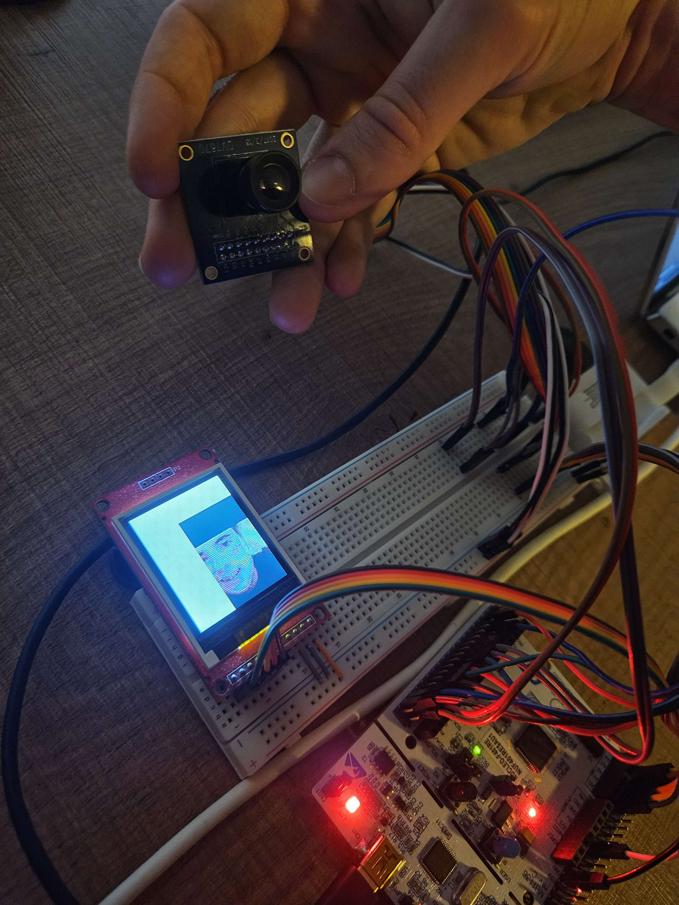

# Bare-Metal Camera

This project captures RGB565 video frames from the OV7670 camera and displays them on an ST7735 LCD using an STM32F401RE microcontroller.
Written in bare-metal Rust with no HAL or libraries.



## Flash Firmware

```sh
cargo flash --chip STM32F401RETx --release
```

## Attach to Serial Terminal

```sh
screen /dev/ttyACM0 115200
```

## Wiring

### OV7670 Camera

| Camera Pin | STM32 Pin | Function              |
|------------|-----------|-----------------------|
|3.3V        |3.3        |Power                  |
|SCL         |PB8        |SCCB clock (I2C1_SCL)  |
|VS          |PA6        |Vsync (GPIO)           |
|PCLK        |PA9        |Pixel Clock (GPIO)     |
|D7          |PC7        |Data[7] (GPIO)         |
|D5          |PC5        |Data[5] (GPIO)         |
|D3          |PC3        |Data[3] (GPIO)         |
|D1          |PC1        |Data[1] (GPIO)         |
|RET         |3.3        |Reset (unused)         |
|DGND        |GND        |Ground                 |
|SDA         |PB9        |SCCB data (I2C1_SDA)   |
|HS          |PB3        |HSync (GPIO)           |
|XCLK        |PA8        |External clock (MCO_1) |
|D6          |PC6        |Data[6] (GPIO)         |
|D4          |PC4        |Data[4] (GPIO)         |
|D2          |PC2        |Data[2] (GPIO)         |
|D0          |PC0        |Data[0] (GPIO)         |
|PWDN        |GND        |Power down (unused)    |

### ST7735 Display

| LCD Pin | STM32 Pin | Function                  |
|---------|-----------|---------------------------|
|VCC      |3.3        |Power                      |
|GND      |GND        |Ground                     |
|CLK      |PA5        |SPI1_SCK                   |
|SDA      |PA7        |SPI1_MOSI                  |
|RS       |PA4        |Data/Command select (GPIO) |
|RST      |PA1        |Reset line (GPIO)          |
|CS       |PA0        |Chip Select (GPIO)         |